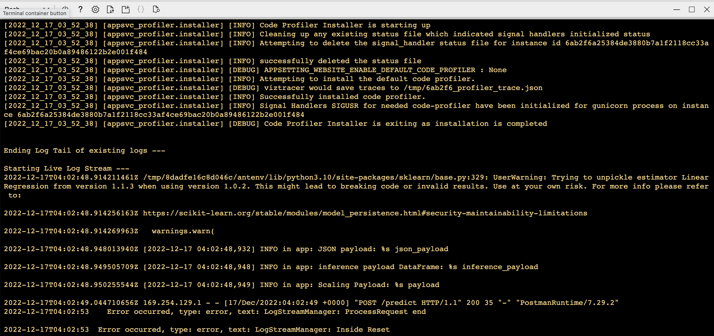

# Overview

This project uses GitHub Actions and Azure Pipeline to build a CI/CD Pipeline to deploy Machine Learning Microservices API using Python Flask.

## Project Plan

* A link to a Trello board for the project
https://trello.com/b/QA6wHbmo/p2
* A link to a spreadsheet that includes the original and final project plan
https://docs.google.com/spreadsheets/d/1Ne7JwKaWu5Rlz_zxjueZKr-4lACrVTAuxI7p3jBMKtQ/edit?usp=sharing

## Instructions

* Architectural Diagram (Shows how key parts of the system work)


### Set Up Azure Cloud Shell

- Create ssh-keys in Azure Cloud Shell
```
ssh-keygen -t rsa
cat ~/.ssh/id_rsa.pub
```
- Upload ssh-keys to Github (GitHub > Settings > SSH and GPG keys > New SSH key > Add SSH key)

* Project running on Azure App Service


* Project cloned into Azure Cloud Shell
```
git clone git@github.com:ngocnd10/p2.git
```


* Passing tests that are displayed after running the `make all` command from the `Makefile`

Create the Python Virtual Environment
```
cd p2
python3 -m venv ~/.p2
source ~/.p2/bin/activate
```
Install
```
make all
```


Deploy 
```
az webapp up -n <your-app-name> -l eastus --resource-group <your-resource-group> --sku B1
```

* Output of a test run


* Successful deploy of the project in Azure Pipelines.  [Note the official documentation should be referred to and double checked as you setup CI/CD](https://docs.microsoft.com/en-us/azure/devops/pipelines/ecosystems/python-webapp?view=azure-devops).


* Running Azure App Service from Azure Pipelines automatic deployment


* Successful prediction from deployed flask app in Azure Cloud Shell.  [Use this file as a template for the deployed prediction](https://github.com/udacity/nd082-Azure-Cloud-DevOps-Starter-Code/blob/master/C2-AgileDevelopmentwithAzure/project/starter_files/flask-sklearn/make_predict_azure_app.sh).
The output should look similar to this:

```bash
udacity@Azure:~$ ./make_predict_azure_app.sh
Port: 443
{"prediction":[20.35373177134412]}
```


* Output of streamed log files from deployed application
```
az webapp log tail
```



## Enhancements

- Deploy with Docker or Kubernetes
- Create infrastructure as code with Terraform
- Design and update Web UI
- Improve ML model

## Demo 

https://youtu.be/DkWN_1n484M 


